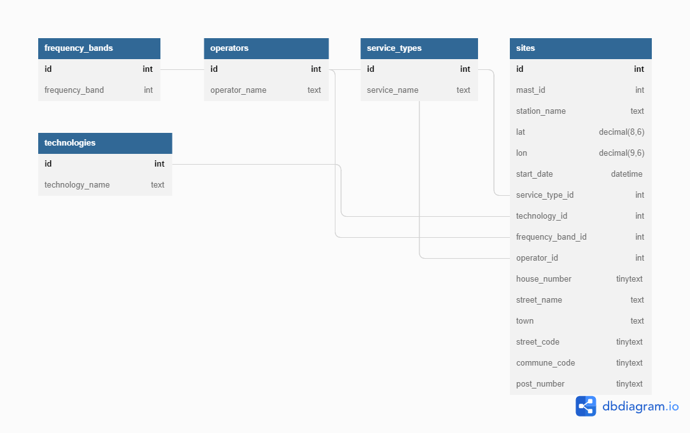

# Mastedatabasen.dk API

This is a custom API wrapper for all data on the official Danish antenna map ([mastedatabasen.dk](https://mastedatabase.dk)).

## Running locally

> ⚠️ You'll need to have Docker and Docker Compose to use this.

Set up a MySQL root password file. This should be stored alongside `docker-compose.json` and be named `mysql_root_pwd.txt`. The file should contain only the password (and no trailing new line). **You should treat this file as secret and store it securely.**

Simply start the Docker containers using Docker Compose.

```
docker-compose up -d
```

This will automatically start and set up a MySQL database with the required base structure for importing mastedatabasen.dk data. If you don't already have a copy of this, you might want to use my [mastedatabasen.dk data scraper tool](https://github.com/davwheat/mastedatabasen-dk-scraper).

## Import scraped JSON data

To import scraped JSON data, copy your `sites_current_with_operator.json` file from your scraper folder into this repo, then run the `import_mastedatabasen_dump.py` script.

The script will attempt to read the `mysql_root_pwd.txt` file, and connect to the DB with `root@127.0.0.1`, then process the JSON and insert all the records into the DB.

It will not insert records where a site with the same `masteId`/`mast_id` already exists, in order to help performance with future data imports.

## Database structure


